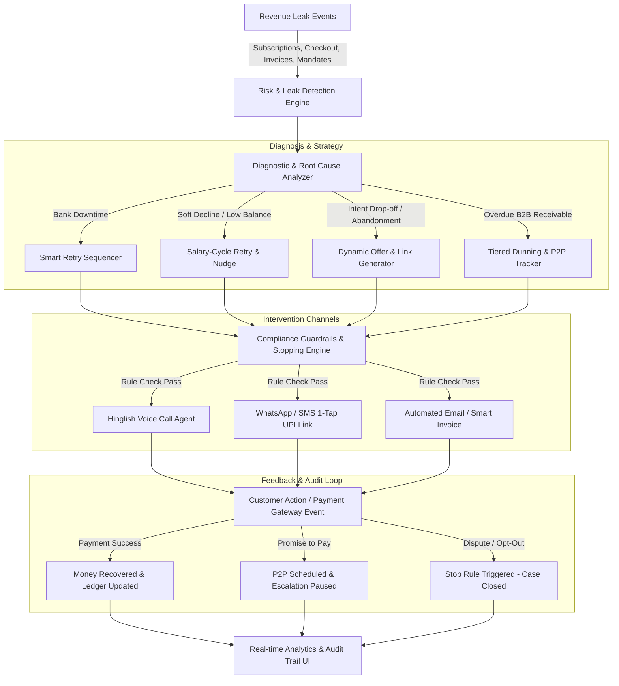

# 🛡️ Razorpay RevGuard AI
### Autonomous AI Revenue Recovery Engine • Track 03: AI Revenue Recovery

> **Find revenue that’s slipping away and win it back.**
> RevGuard AI closes the loop from detecting payment failures, checkout drop-offs, failed subscriptions, and overdue B2B receivables to diagnosing root causes, determining compliant interventions, and executing automated recovery workflows.

---

## 🚀 Why RevGuard AI?

Revenue loss rarely happens in one clean step:
- **Payment Degradation**: Bank gateways face temporary outages or network throttling.
- **Subscription Failures**: UPI AutoPay, eNACH, and recurring cards soft-decline due to salary cycles or temporary low balance.
- **Checkout Abandonment**: High-intent shoppers drop out at the final payment step.
- **B2B Receivables**: Invoices age past due dates without structured follow-ups.

**RevGuard AI** delivers autonomous, multi-channel recovery backed by **RBI/DPDP compliance guardrails, strict stopping rules, and an immutable audit ledger**.

---

## ✨ Key Features & Innovations

### 1. 🔍 Multi-Vector Risk & Root Cause Diagnosis
- Classifies failures into **4 Core Vectors**:
  1. *Failed Subscriptions* (UPI AutoPay / eMandates / Recurring Cards)
  2. *Checkout Drop-offs* (Cart abandonment & checkout payment failures)
  3. *Overdue B2B Invoices* (Aging matrix & tiered receivables dunning)
  4. *UPI Mandate Retries* (Bank gateway degradation detection)
- Distinguishes **Soft Declines** (low balance / temporary) vs **Hard Declines** (closed accounts / expired cards) vs **Technical Timeouts** (issuing bank downtime) vs **Intent Loss**.

### 2. 🗣️ Hinglish Conversational Voice AI Simulator
- Realistic voice outreach in **Hinglish** (*"Namaste Rohitji, aapka ₹1,499 subscription payment complete nahi ho paya tha..."*).
- Synthesizes live speech via Web Speech API with caller waveforms and transcript.
- Supports interactive **Promise-to-Pay (P2P)** negotiation:
  - Automatically records the promised payment date.
  - Pauses all active dunning and escalations until the agreed timestamp.

### 3. 💬 WhatsApp 1-Tap UPI Nudges
- Simulates official Razorpay verified WhatsApp payment cards.
- Integrates 1-Tap UPI deep links (GPay / PhonePe / Paytm).
- Applies **dynamic limited-time discounts** (e.g. 5% instant discount) for checkout abandonments to drive conversion.

### 4. 📅 Salary-Cycle Aware Mandate Sequencer
- Aligns recurring retries around Indian salary cycles (28th–5th of month).
- Delays retries during issuing bank downtimes (HDFC, ICICI, SBI, Axis, Kotak) to prevent failed attempt penalties.

### 5. 🛡️ RBI / DPDP Compliant Escalation & Stopping Rules ("The Bar")
- **TRAI / RBI DND Window Enforcement**: Halts voice/SMS interventions during quiet hours (8 PM – 9 AM IST).
- **Frequency Capping**: Maximum 3 touchpoints per week before human escalation.
- **Dispute Auto-Freeze**: Instant kill-switch on customer dispute or opt-out.
- **Hard Decline Fast-Exit**: Suppresses repeated retries on expired cards to save bank fees.

### 6. 📊 Real-Time Batch Simulator & Immutable Audit Ledger
- Runs live batch recovery across 50+ payment failure cases.
- Displays live money tick-up, recovery velocity, and celebration confetti.
- Full cryptographic audit log tracking every actor (`RISK_ENGINE`, `AI_INTERVENTION_AGENT`, `COMPLIANCE_GUARD`, `CUSTOMER`), timestamps, and compliance policy checks.

---

## 🏗️ System Architecture



---

## 💻 Tech Stack

- **Frontend**: React 19 + TypeScript + Vite + Tailwind CSS v4
- **Visualizations**: Recharts
- **Icons**: Lucide React
- **Audio & Voice**: Web Speech API
- **Animations & Effects**: Canvas Confetti

---

## 🛠️ Getting Started

### 1. Clone the Repository
```bash
git clone https://github.com/Arpitm544/Ai_-Revenue_recover.git
cd Ai_-Revenue_recover
```

### 2. Install Dependencies
```bash
npm install
```

### 3. Start Development Server
```bash
npm run dev
```
Open [http://localhost:5173](http://localhost:5173) in your browser.

### 4. Build for Production
```bash
npm run build
```

---

## 🏆 Track 03 Alignment Matrix

| Evaluation Criteria | How RevGuard AI Solves It |
|---|---|
| **Root Cause Diagnosis** | Identifies technical timeouts, soft low-balance vs hard declines, and checkout intent drop-off. |
| **Intervention Strategy** | Dispatches salary-aligned retries, Hinglish voice calls, and WhatsApp 1-tap UPI deep links. |
| **Stopping Rules** | Enforces RBI DND hours, dispute auto-freeze, hard decline fast-exit, and max 3 touchpoints. |
| **Promise-to-Pay (P2P)** | Interactive ledger tracks customer promise dates and freezes dunning automatically. |
| **Measured Recovery ("The Bar")** | Live batch runner with real-time ₹ recovered counter, ROI calculation, and immutable audit trail. |

---

Built for **Razorpay Hackathon 2026**.
